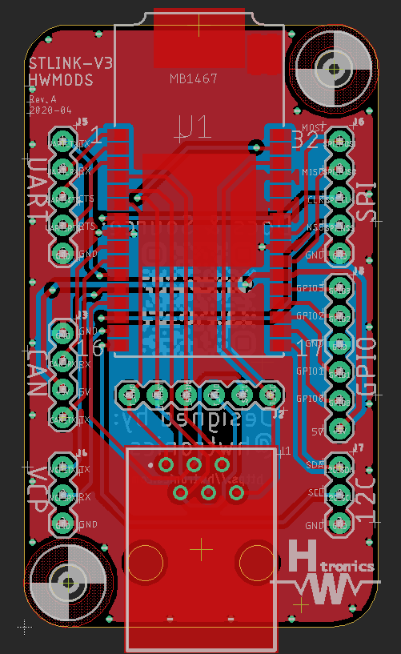
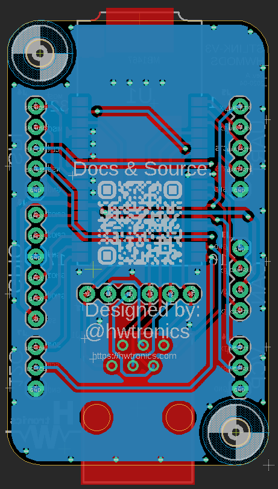

# STLINK-V3-HWMOD

Custom developed board that allow you to use the new STLINK-V3MODS with the Tag-Connect cable.

## Preview of the board:

## Prerequisite
Autodesk Eagle

## Social Media Links

Instagram: [@hwtronics](https://www.instagram.com/hwtronics/)
Facebook: [@hwtronics](https://www.facebook.com/hwtronics/)
Twitter: [@hwtronics](https://twitter.com/hwtronics)

Distributed under the GNU General Public License v3.0 license. See ``LICENSE`` for more information.

For any further info please contact us by email: info@hwtronics.com !!!

## Contributors

-[@dinamitemic](https://github.com/dinamitemic)
-[@AnnaBiguzzi](https://github.com/AnnaBiguzzi)

## Contributing

1. Fork it (<https://github.com/yourname/yourproject/fork>)
2. Create your feature branch (`git checkout -b feature/fooBar`)
3. Commit your changes (`git commit -am 'Add some fooBar'`)
4. Push to the branch (`git push origin feature/fooBar`)
5. Create a new Pull Request
